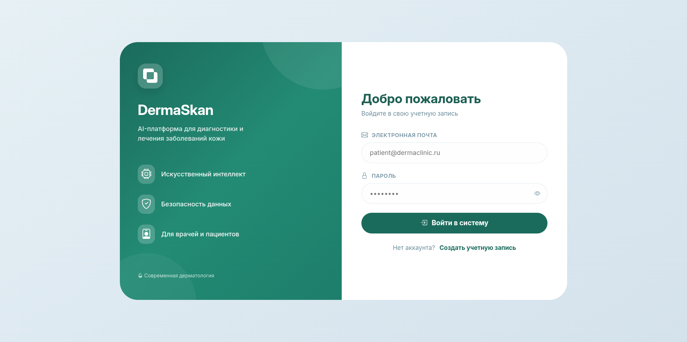
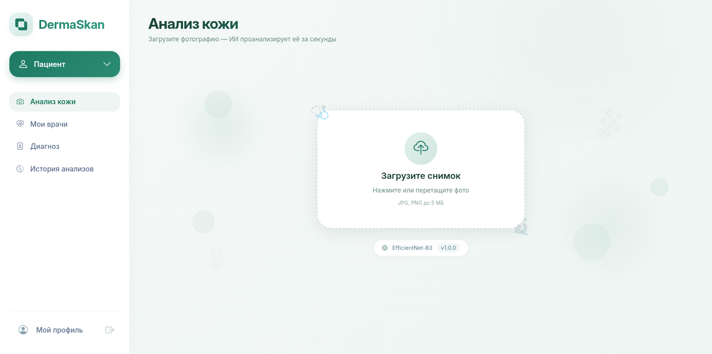
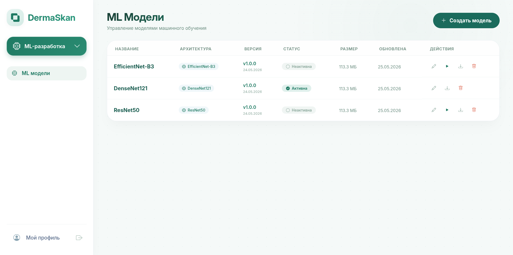
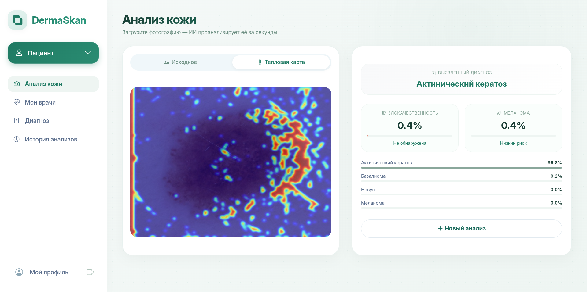

# 🩺 DermaSkan

<div align="center">

### Интеллектуальная система анализа кожных новообразований

#### Гибридная AI-архитектура на базе Vision Transformer + CNN

<p align="center">
  
  
  
  
  
</p>

<p align="center">
  <b>AI-платформа для поддержки диагностики в дерматологии</b><br>
  Анализ изображений • Grad-CAM визуализация • ViT + CNN • FastAPI
</p>

</div>

---

# ✨ О проекте

**DermaSkan** — это интеллектуальная система поддержки принятия врачебных решений в области дерматологии, использующая современные методы компьютерного зрения и глубокого обучения для анализа кожных новообразований.

Проект сочетает:

* 🧠 **Vision Transformer (ViT)** для глобального анализа изображения
* 🔬 **CNN-архитектуры** для извлечения локальных признаков
* 🌡️ **Grad-CAM визуализацию** для интерпретации решений модели
* ⚡ **FastAPI backend** для высокопроизводительного inference API

Система предназначена как для исследовательских задач в области Medical AI, так и для практического применения в качестве инструмента поддержки врача.

---

# 🚀 Основные возможности

<div align="center">

| Возможность                          | Описание                                                 |
| :----------------------------------- | :------------------------------------------------------- |
| 🔍 **Бинарная классификация**        | Определение: злокачественное / доброкачественное         |
| 🧬 **Мультиклассовая классификация** | Меланома • Невус • Кератоз • Basal Cell Carcinoma        |
| 🌡️ **Grad-CAM визуализация**        | Подсветка областей изображения, влияющих на предсказание |
| 📊 **Интерпретируемый AI**           | Повышение прозрачности работы модели                     |
| ⚡ **Быстрый inference**              | Анализ изображения менее чем за 10 секунд                |
| 🐳 **Docker-ready**                  | Полная контейнеризация проекта                           |
| 📘 **REST API**                      | Интеграция с внешними сервисами                          |
| 🔐 **Система ролей**                 | Поддержка пользователей и прав доступа                   |

</div>

---

## 📸 Интерфейс приложения

<div align="center" class="carousel-container">
  <div class="carousel">
    <div class="carousel-inner">
      <div class="carousel-item active">
        
        <div class="caption">Страница входа</div>
      </div>
      <div class="carousel-item">
        
        <div class="caption">Анализ изображения</div>
      </div>
      <div class="carousel-item">
        
        <div class="caption">ML модели</div>
      </div>
      <div class="carousel-item">
        
        <div class="caption">Результат предсказания</div>
      </div>
    </div>
    
    <button class="carousel-control prev" onclick="prevSlide()">❮</button>
    <button class="carousel-control next" onclick="nextSlide()">❯</button>
    
    <div class="carousel-indicators">
      <span class="dot active" onclick="currentSlide(0)"></span>
      <span class="dot" onclick="currentSlide(1)"></span>
      <span class="dot" onclick="currentSlide(2)"></span>
      <span class="dot" onclick="currentSlide(3)"></span>
    </div>
  </div>
</div>

<style>
.carousel-container {
  max-width: 800px;
  margin: 0 auto;
  position: relative;
}

.carousel {
  position: relative;
  overflow: hidden;
  border-radius: 12px;
  box-shadow: 0 4px 12px rgba(0,0,0,0.15);
}

.carousel-inner {
  display: flex;
  transition: transform 0.5s ease;
}

.carousel-item {
  min-width: 100%;
  position: relative;
}

.carousel-item img {
  width: 100%;
  display: block;
}

.caption {
  position: absolute;
  bottom: 0;
  left: 0;
  right: 0;
  background: rgba(0,0,0,0.7);
  color: white;
  padding: 10px;
  text-align: center;
  font-size: 14px;
}

.carousel-control {
  position: absolute;
  top: 50%;
  transform: translateY(-50%);
  background: rgba(0,0,0,0.5);
  color: white;
  border: none;
  padding: 12px 18px;
  cursor: pointer;
  font-size: 24px;
  border-radius: 50%;
  transition: background 0.3s;
}

.carousel-control:hover {
  background: rgba(0,0,0,0.8);
}

.prev {
  left: 10px;
}

.next {
  right: 10px;
}

.carousel-indicators {
  position: absolute;
  bottom: 15px;
  left: 50%;
  transform: translateX(-50%);
  display: flex;
  gap: 10px;
}

.dot {
  width: 10px;
  height: 10px;
  background: rgba(255,255,255,0.5);
  border-radius: 50%;
  cursor: pointer;
  transition: background 0.3s;
}

.dot.active {
  background: white;
}

.dot:hover {
  background: rgba(255,255,255,0.8);
}
</style>

<script>
let currentIndex = 0;
const items = document.querySelectorAll('.carousel-item');
const dots = document.querySelectorAll('.dot');

function updateCarousel() {
  const inner = document.querySelector('.carousel-inner');
  inner.style.transform = `translateX(-${currentIndex * 100}%)`;
  
  dots.forEach((dot, index) => {
    dot.classList.toggle('active', index === currentIndex);
  });
}

function nextSlide() {
  currentIndex = (currentIndex + 1) % items.length;
  updateCarousel();
}

function prevSlide() {
  currentIndex = (currentIndex - 1 + items.length) % items.length;
  updateCarousel();
}

function currentSlide(index) {
  currentIndex = index;
  updateCarousel();
}

// Auto-play (опционально)
setInterval(() => {
  nextSlide();
}, 5000);
</script>

---

# 🛠️ Технологический стек

<div align="center">

| Backend     | ML/AI              | Frontend      | Infrastructure |
| ----------- | ------------------ | ------------- | -------------- |
| FastAPI     | PyTorch            | HTML5         | Docker         |
| Python 3.11 | Vision Transformer | TailwindCSS   | Docker Compose |
| SQLAlchemy  | CNN                | JavaScript    | PostgreSQL     |
| JWT Auth    | Grad-CAM           | Responsive UI | Nginx          |

</div>

---

# ⚙️ Быстрый старт

## 📋 Требования

Перед запуском убедитесь, что установлены:

* Docker
* Docker Compose
* Git

---

## 🔧 Установка

### 1️⃣ Клонирование репозитория

```bash
git clone https://github.com/gigAntov3/derma-ml-skan.git
cd derma-ml-skan
```

### 2️⃣ Запуск проекта

```bash
docker-compose up -d
```

### 3️⃣ Настройка ролей пользователя

```bash
docker exec -it postgres-db psql -U derma_user -d derma_ml_db \
-c "INSERT INTO user_roles (user_id, role_id) VALUES (1, 4);"
```

---

# 🌐 Доступ к сервисам

| Сервис            | URL                         |
| ----------------- | --------------------------- |
| 🖥️ Веб-интерфейс | `http://localhost`          |
| 📘 Swagger API    | `http://localhost/api/docs` |
| ❤️ Health Check   | `http://localhost/health`   |

---

# 🧠 ML-возможности

## Поддерживаемые задачи

### 🔍 Binary Classification

* Злокачественное / доброкачественное образование
* Меланома / не меланома

### 🧬 Multi-class Classification

* Melanoma
* Nevus
* Keratosis
* Basal Cell Carcinoma (BCC)

---

# 🌡️ Explainable AI

Проект использует **Grad-CAM** для визуализации внимания модели.

Это позволяет:

* интерпретировать предсказания нейросети;
* выделять области изображения, влияющие на результат;
* повышать доверие к AI-системе;
* помогать врачам в принятии решений.

---